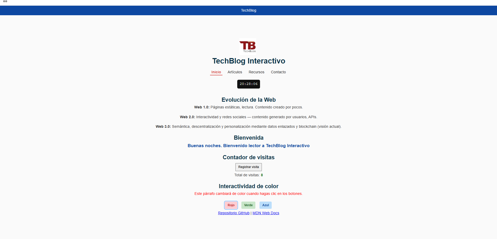
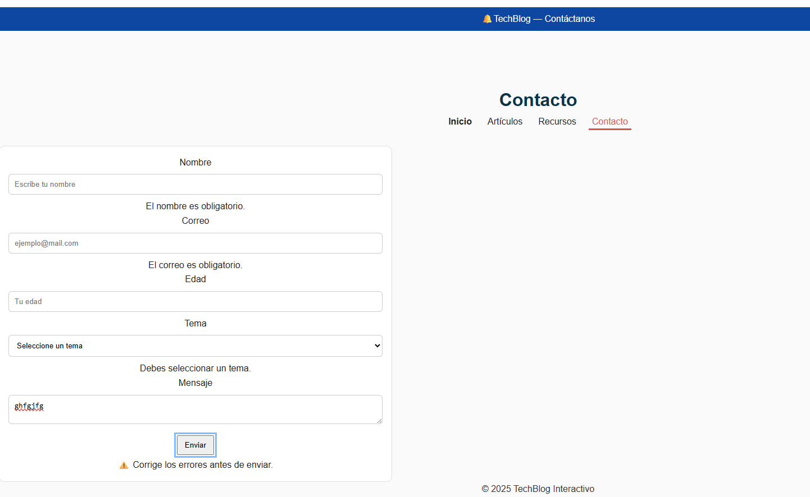
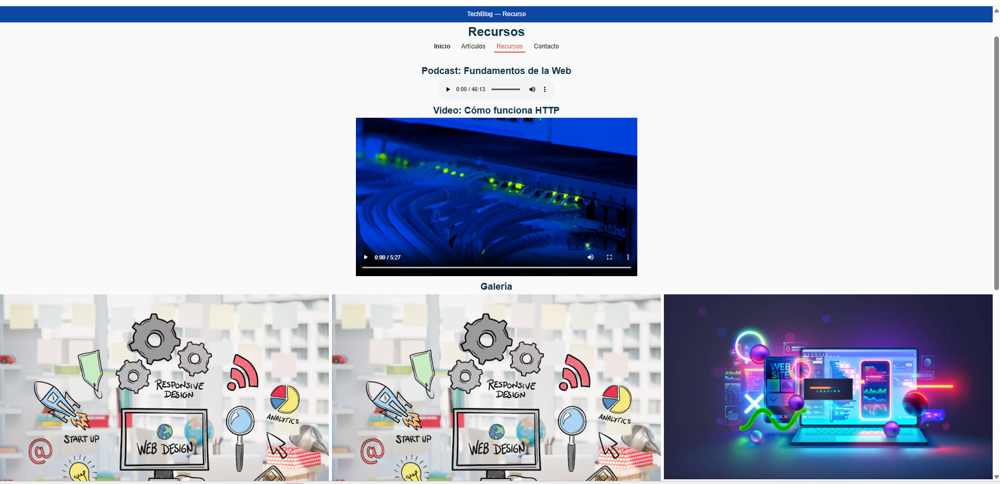

# TechBlog Interactivo

Sitio demo: blog académico sobre tecnología. Contiene 5 páginas y ejemplos de HTML5, CSS3 y JS.

Diagrama: Ciclo de vida de una petición web (resumen)
1. El usuario solicita una URL en el navegador (ej. escribe o hace click).
2. El navegador resuelve el dominio (DNS) para obtener la IP del servidor.
3. El navegador crea y envía la petición HTTP(S) al servidor (por la red).
4. El servidor recibe la petición, la procesa (aplica lógica, lee DB si necesario).
5. El servidor crea una respuesta (HTML/CSS/JS/JSON) y la envía de vuelta.
6. El navegador recibe la respuesta, interpreta y renderiza HTML/CSS, ejecuta JS.
7. El navegador puede realizar nuevas peticiones asíncronas (AJAX / fetch) según la interacción.

Checklist (marcar al entregar)
- [x] Repositorio público con nombre `TechBlog-Interactivo`.
- [x] Estructura de carpetas y archivos según enunciado (css/styles.css, js/app.js, media/).
- [x] `index.html` explica evolución Web y muestra protocolo en consola.
- [x] `articulos.html` tiene exactamente 3 `<article>` (con h2, 2 p, img alt y listas).
- [x] `recursos.html` contiene audio.mp3 y video.mp4 en /media con fallback.
- [x] `contacto.html` formulario con validaciones y mensajes de error.
- [x] `css/styles.css` enlazado en todas las páginas y contiene los selectores requeridos.
- [x] `js/app.js` contiene APP_NAME, visitas inicializadas en 0, saludo dinámico, contador, botones de color, notas, validaciones.
- [x] Uso de buenas prácticas de accesibilidad (alt, roles, aria-live, focus visible).

-
Carlos Rodriguez  — 2025

Capturas

